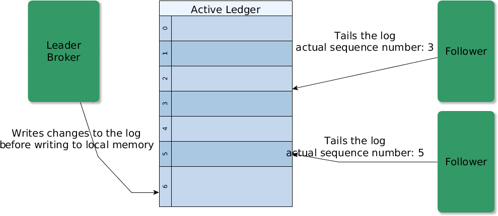

# majordodo-docs-drafts

## Bookkeeper usage on Majordodo 

 This document describes how Majordodo uses Bookeeper to implement a replicated state machine without sharing any other medium other then BookKeeper.
 The global status of the system in mantained on a bunch of machines (brokers), every change to the status is first written to the log and then applied to memory.

## An introduction to Majordodo

  Majordodo is a **Distributed Resource Manager**, its main purpose it to allocate resources to execute lots of concurrent tasks submitted by many users.

  The focus is on multi-tenancy and on the ability to handle millions of micro-tasks on hundreds of machines.
    
  The primary business requirements is the ability to provide access to shared resources to a lot of users but giving to every one a configurable amount of resources (multitenancy), in terms of CPU, RAM, SQL/HBase Databases and (distributed) filesystem-like storage.

  Majordodo has been designed to deal with thousands of users which request executions of micro tasks, it is just like having a very big distributed ThreadPool with complex resource allocation facilities, which can be reconfigured at runtime.

  Guaranteed Service Level can be changed at runtime even for tasks which have already been submitted to the system.

  Majordodo tasks can be very simple tasks, such as sending a single email message or long running batch operations which can continue running for hours.

  When a task is assigned to a specific machine (a 'Worker' in Majordodo words) the Broker will follow its execution, monitor it and eventually fail over the execution to another Worker in case of machine failure.

  Majordodo has been designed to deal with Worker machines which can fail at any time, which is a fundamental aspect in elastic deployments: to this end, in Majordodo, tasks get simply resubmitted to other machines in a transparent way, according to service level configuration.

  Majordodo clients submit tasks to a Broker service using a simple HTTP JSON-based API supporting transactions and the 'slots' facility.

  Workers discover the actual leader Broker and keep one and only one active TCP connection to it. Broker-to-Worker and Broker-to-Broker protocol has been designed to support asynchronous messaging and one connection per Worker is enough for task state management. The networking stack scales well up to hundreds of Workers with a minimal overhead on the Broker (thanks to Netty).

  Majordodo is built upon Apache BookKeeper and Apache Zookeeper, leveraging these powerful systems to implement replication and face all the usual distributed computing issues.

## Majordodo and Zookeeper

  Majordodo Clients use Zookeeper to discover active Brokers on the network.
  On the Broker side Majordodo uses Zookeeper for many situations: it uses it directly to address leader election, to advertise the presence of services on the network and to keep metadata about BookKeeper ledgers. BookKeeper in turn uses Zookeeper for Bookie discovery and for ledger metadata storage.

  Among all the Brokers one is elected as 'leader', clients can connect to any of the Brokers but only the leader can change the 'status' of the system, like accepting task submissions, and handling Workers connections.
  Zookeeper is used to manage a shared view of the list of BookKeeper ledgers. The leader Broker creates new ledgers and drops unused ledgers, keeping on Zookeeper the list of actual ledgers.
  Zookeeper allows the Broker to manage this kind of metadata in a safe manner, using CAS (compare and set) operations. Upon accessing the ledger list, the Broker can issue a conditional modification operation requesting it to fail if another Broker took control.

  We use a simple leader election algorithm 

## BookKeeper usage overview

  Apache BookKeeper is used to implement a distributed commit log with a shared nothing architecture: no shared disk or database is needed to make all the Brokers share the same view of the global status of the system.
  BookKeeper is ideal for replicating the state of Brokers, the leader Broker has a global view of the status of the system in memory and logs every change to a Ledger.
  BookKeeper is used as a write-ahead commit log, that is that every change to the status is written to the log and then it is applied to the in-memory status.
  The other Brokers (we name them 'followers') tail the log and apply each change to their own copy of the status.
  
  As BookKeeper ledgers can only be written once, if another broker starts the recovery process and opens the ledger for reading it automatically fences the previous writer so as to allow no more writes on that ledger .
  In case of leadership change, for instance in case of temporary network failures, the 'old' leader Broker is not able to log entries any more and thus it cannot 'change' the global status of the system in memory.

## Tailing the log and replicating the state

  Followers continuously read BookKeeper logs and replay each action on the local state. 

  This operation is done opening in no-recovery mode the ledger which is actually beeing written to by the leader Broker.

  This 'tail' operation is very fast because of the internal design of the Bookie service, which keeps in memory the last entries written by the client.  

 

## Snapshots

  The only shared structures between Brokers are the Zookeeper 'filesystem' and the BookKeeper ledgers, but logs cannot be retained forever, accordingly each Broker must periodically take a snapshot of its own in-memory view of the status and persist it to disk in order to recover quickly and in order to let BookKeeper release space and resources.

  When a Broker boots it loads a consistent snapshot of the status of the system at a given time and then starts to replay the log from the time (ledger offset) at which the snapshot was taken.

  If no local snapshot is available the booting Broker discovers an active Broker in the network and downloads a valid snapshot from the network. For a Majordodo Broker with 100.000 active tasks the medium snapshot size is around 50 MBytes, depending on task data payload.
  

## Ledgers management

  The leader Broker mantains a list of active ledgers on ZooKeeper. It must store the ledger ids and the creation timestamp of each ledger.
  
  The update of the list of ledgers on ZooKeeper must be a CAS operation (update with version) to prevent multiple Brokers to modify le list concurrently.
  
  We delete old ledgers after a configurable amount of time, for instance when a ledger is not used and has been created 48 hours in the past.

  In order to choose the olddest ledgers we need to store the creation timestamp for each ledger. By default when a 'follower' Broker remains offline for more than 48 hours at the time of the boot it need to find another Broker on the network and download a snapshot, otherwise the boot will fail.

  We also need to store the **id of the very first ledger** used by the system in order to let new Brokers know that using the actual list of ledgers on ZooKeeper it is not possible to replay the whole history of the system. 

  In fact if the very first ledger of the history of the system is not present, any broker can read all the ledgers and build a consistent state.

  

  